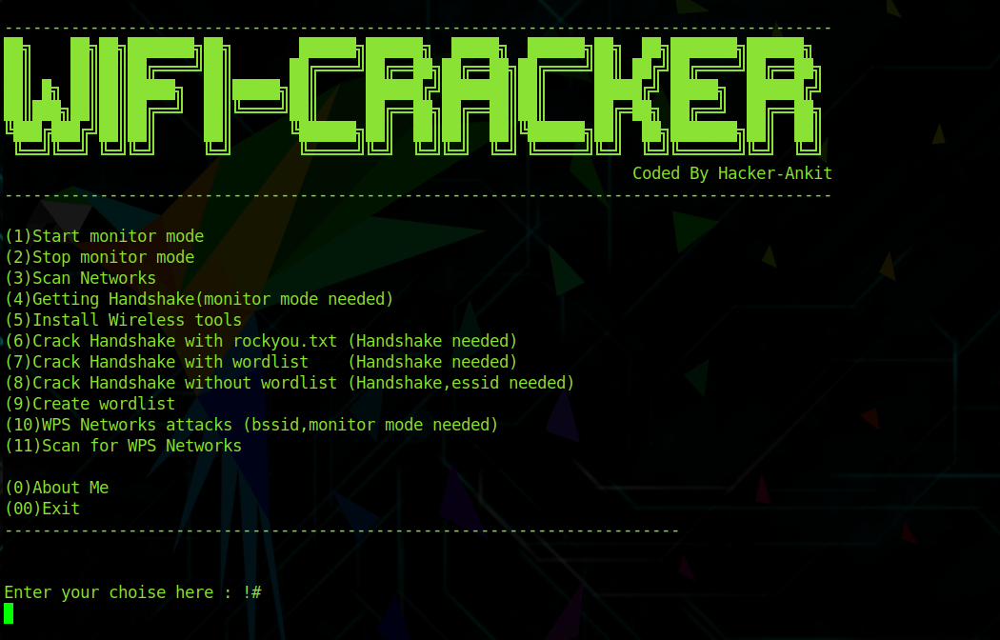
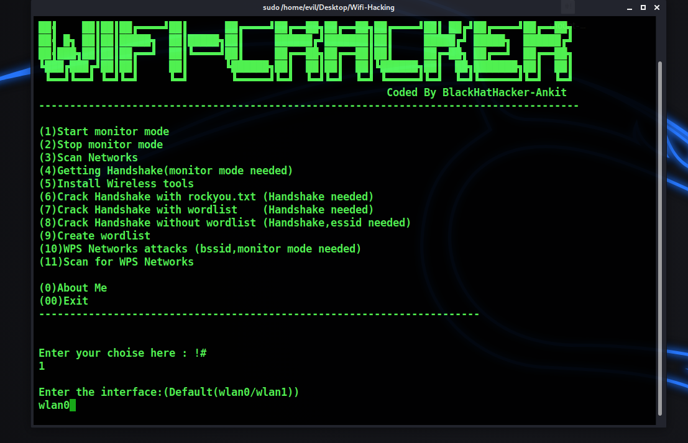
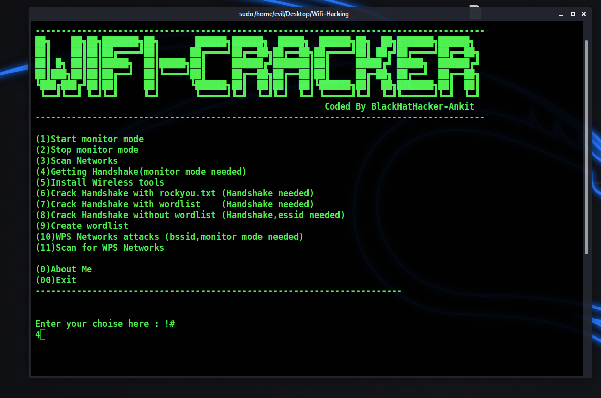
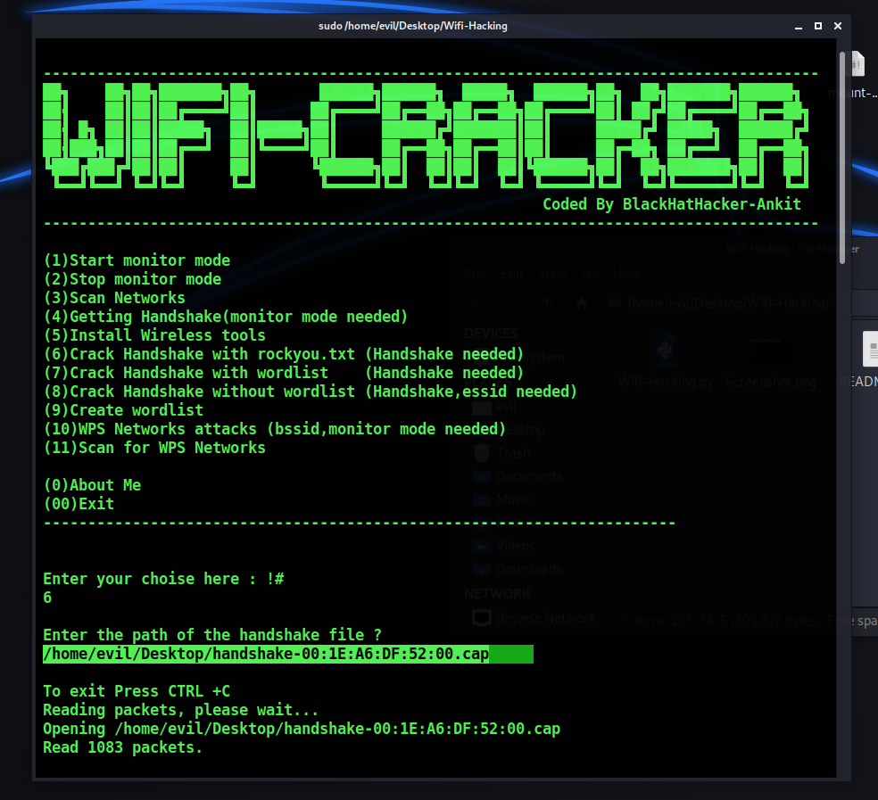

[](http://www.python.org/download/)
[](https://www.python.org/downloads/release/python-2714/)
[](https://termux.com/)

# Wifi-Hacking.py  

No Need To Ask Wifi Password, HACK it..! This Cyber Security Tool, Will Hack For You Any Wifi-Password..!

[](https://asciinema.org/a/362908)

## Complete Guide: How to Hack a WiFi Network from A to Z

### Step 1: Installation
```bash
# Clone the repository
git clone https://github.com/ankit0183/Wifi-Hacking

# Navigate to the directory
cd Wifi-Hacking/

# Run the script
sudo python3 Wifi-Hacking.py
```

### Step 2: Start Monitor Mode
1. From the main menu, select option `1` (Start monitor mode)
2. Enter your wireless interface name (usually `wlan0` or `wlan1`)
3. The script will enable monitor mode on your interface (it will be renamed to something like `wlan0mon`)

### Step 3: Scan for Networks
1. Select option `3` (Scan Networks)
2. Enter your monitor mode interface (e.g., `wlan0mon`)
3. A list of available WiFi networks will appear
4. Note down the BSSID (MAC address) and channel of your target network
5. Press CTRL+C to stop scanning when done

### Step 4: Capture Handshake
1. Select option `4` (Getting Handshake)
2. Enter your monitor mode interface
3. The script will show available networks again
4. After scanning, enter the BSSID of your target network
5. Enter the channel number of the target network
6. Specify a path to save the handshake file (e.g., `/home/user/handshakes/target`)
7. Enter the number of deauthentication packets to send (0 for unlimited)
8. The script will start capturing packets while sending deauth packets
9. Wait until you see "WPA Handshake: [BSSID]" in the top right corner
10. Press CTRL+C to stop capturing once you have the handshake

### Step 5: Crack the Password
You have three options to crack the captured handshake:

#### Option A: Using rockyou.txt wordlist
1. Select option `6` (Crack Handshake with rockyou.txt)
2. Enter the path to your handshake file (e.g., `/home/user/handshakes/target-01.cap`)
3. The script will attempt to crack the password using the rockyou.txt wordlist

#### Option B: Using a custom wordlist
1. Select option `7` (Crack Handshake with wordlist)
2. Enter the path to your handshake file
3. Enter the path to your custom wordlist
4. The script will attempt to crack the password using your wordlist

#### Option C: Creating and using a custom wordlist
1. Select option `9` (Create wordlist)
2. Enter minimum and maximum password length
3. Enter the output file path
4. Enter the character set to use
5. Then use option `7` to crack with this new wordlist

### Step 6: Stop Monitor Mode
1. When finished, select option `2` (Stop monitor mode)
2. Enter your monitor interface name (e.g., `wlan0mon`)
3. The script will disable monitor mode and restart network services

### Additional Features:
- Option `5`: Install wireless tools for additional functionality
- Option `8`: Crack handshake without a wordlist (generates passwords on-the-fly)
- Option `10`: WPS Networks attacks (for networks with WPS enabled)
- Option `11`: Scan specifically for WPS-enabled networks

## Features and Contains:

```bash 
1)Start monitor mode
2)Stop monitor mode
3)Scan Networks   
4)Getting Handshake
5)Create wordlist
6)Install Wireless tools                  
7)WPS Networks attacks 
8)Scan for WPS Networks
9)Crack Handshake with rockyou.txt
10)Crack Handshake with wordlist
11)Crack Handshake without wordlist
```


# SCREENSHOT








# Disclaimer 
Wifi-Hacking tool not responsible for misuse and for illegal purposes. Use it only for Pentest or Educational purpose :smile: !!!

> Pull requests are always welcome.. :)  


### Happy Hacking (Privacy & Security No Such Things Exists in digital World, We Can Hack Everything)

### Creator 

The creator of this tools is Ankit Kanojiya special thanks to him 
you can find his GitHub here : https://github.com/ankit0183/Wifi-Hacking
And don't forget to buy him a coffee ! :smile: